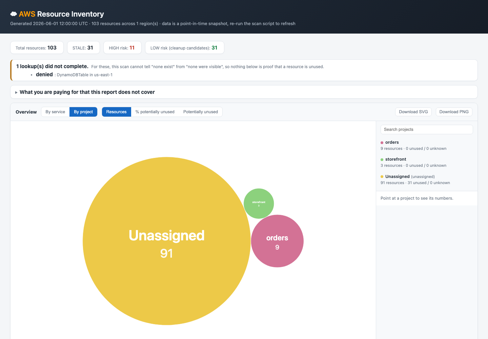

# AWS Cleanup

**Which of these AWS resources can I delete, and what is still costing me?**

A read-only auditor for a personal or small AWS account. It inventories resources
across regions, pulls whatever "last used" signal each service actually exposes,
groups resources into projects, attributes the bill where it honestly can, and
flags stale or orphaned candidates for cleanup — via a CLI
(`aws_resource_audit.py` / `aws_regenerate_report.py`) or a local web app
(`docker compose up`).

It never deletes anything. It tells you what it found, how sure it is, and why.



> **Status:** a personal project, shared as-is. It is read-only by design, but you
> run it against your own account at your own risk. MIT licensed, no warranty.

## Why trust this with your AWS account?

Handing a script `sts:AssumeRole` or IAM credentials is a real ask, so here's
what's true about this one and how to verify it yourself rather than take our
word for it:

- **Read-only by construction, not by promise.** Every AWS call is
  `Describe*`/`List*`/`Get*` — inventory reads, nothing that creates,
  modifies, or deletes a resource. The one exception is opt-in and impossible
  to trigger by accident: `--tag-groups` writes a `Project=<name>` tag, and
  even that runs in dry-run mode unless you also pass `--confirm`. Verify it
  yourself: `aws_resource_audit/collect/` (everything that talks to AWS
  during a scan) contains no `tag_resources`/`create_*`/`delete_*`/`put_*`/
  `modify_*`/`update_*` call at all — the only such call in the whole package
  is `tag_resources` in [`naming/tagging.py`](aws_resource_audit/naming/tagging.py),
  which `run()` reaches only from `--tag-groups`.
- **A least-privilege IAM role ships with the repo**: its permission list is
  exactly the read actions the collectors call — not the AWS-managed
  `ReadOnlyAccess` policy, which covers every AWS service. Deploy
  [`iam/aws-audit-role.yaml`](iam/aws-audit-role.yaml) and the identity you scan
  with never holds more than that; see [`iam/README.md`](iam/README.md) for the
  two-identity setup (a bare `sts:AssumeRole`-only base identity, and the narrow
  role it assumes). `--tag-groups --confirm` deliberately fails through this
  role — the role backing routine scans can't write, on purpose.
- **No network calls except to AWS's own APIs.** No telemetry, no phone-home,
  no third-party endpoint. `aws_resource_audit/collect/` is the only place
  that talks to the network, and it only talks to `boto3`.
- **No dependency beyond `boto3`** for the CLI — nothing else is on the
  network's attack surface or in the supply chain for the path that actually
  touches your account. (The optional web app adds FastAPI/React, but it's
  the same read-only core underneath, still bound to `127.0.0.1` with no
  auth exposed beyond your machine.)
- **A test suite that makes no AWS calls at all**, entirely against mock data
  (`tests/`, see [`tests/README.md`](tests/README.md)) — you can read exactly
  what the code is asserted to do without ever pointing it at a real account.
- **The scan output stays local.** `aws_scan.json` and the rendered reports
  are the whole account's inventory and are `.gitignore`d — nothing is
  uploaded anywhere by this tool.

If you'd rather not take even a read-only role's word for it, run it once
under a profile with no permissions at all — every failed call is reported
explicitly (on the console and in the "Scan coverage" section of
`grouping_audit.md`) rather than silently swallowed, so you can see exactly
what it tried to read.

## Quick start

Needs Python 3.9+ and an AWS profile (ideally one that assumes the role in
[`iam/`](iam/README.md)).

```bash
git clone https://github.com/miritmanor/aws-cleanup.git && cd aws-cleanup
python3 -m venv .venv && . .venv/bin/activate
pip install -r requirements.txt          # boto3, the only dependency

# scan: minutes, ~$0.01-$0.02 (Cost Explorer; see "What a scan costs")
python3 aws_resource_audit.py --all-regions --profile <your-profile>

# re-render the last scan: free, instant, no AWS calls
python3 aws_regenerate_report.py
```

A scan writes into two subdirectories of `output_dir` (default `./Output`):
`results/` holds the seven reports plus the `aws_scan.json` snapshot they render
from — and one `aws_resource_graph-<project>.mmd` and one
`aws_architecture-<project>.drawio` per project alongside the account-wide
diagrams — while `runtime/` holds two debug dumps you only read when something
looks wrong. Start with `results/aws_inventory.html`. The `.drawio` files open in
draw.io (diagrams.net) with its own AWS icons, every box and line editable; the
`.mmd` shows placeholder icons outside this tool.

### Flags

All seven are on `aws_resource_audit.py`; `aws_regenerate_report.py`
deliberately has none. The dividing line is that **a flag is a decision you
make for this run** — where to look, whose credentials, whether to pay for the
cost lookup — while anything standing about the account is configuration.

| Flag | What it does |
|---|---|
| `--all-regions` / `--regions` | Scan scope. With neither, a scan covers the regions saved by earlier scans of the same account (`aws_active_regions.json`), or the profile's default region if there are none. An `--all-regions` scan is what refreshes that list. |
| `--profile` | AWS named profile. **Required** — there is no fallback to whatever `boto3.Session()` finds, so a scan can never run as an unintended identity by accident. |
| `--no-cost` | Skip the chargeable `ce:GetCostAndUsage` call(s) entirely — not "fetch and discard". Cost enrichment runs by default; see "What a scan costs". |
| `--debug` | Print the resolved connection-type table at startup, plus the Lambda env-var dump used for dependency inference. Also sets the log level to DEBUG — see below. |
| `--tag-groups` | Write a `Project=<name>` tag to AWS resources. Dry-run unless `--confirm` is also passed. The only flag that writes to AWS. |

### Projects and their names

A **project** is a set of resources that belong together. It has an **ID**
(`project_id`) and a **name** (the `project_group` column). The terms below are
used the same way everywhere.

| Term | Meaning |
|---|---|
| Project source | What put the project together: an **AWS tag** (`Project`, `App` or `Application`), a **name rule**, a **deployment** (untagged resources joined by ownership links), or **hand-picked** resources. |
| Name | **Default** (the tag value, the rule's name, or a member's name) or **assigned** by you. Any project can be given a name, whatever its source. |
| Grouping method | Why one resource is in its project: `tag`, `rule`, `inferred` (linked to a member), `deployment`, or `named`. |
| Saved name | An entry in `aws_project_groups.json`: a name plus the resources the project had. On each run it is applied to whichever project holds at least 40% of those resources that still exist. A saved name that matches no project is reported. |

"group" and "cluster" mean AWS resource types only (security group, EKS
cluster). Assigning a name has no flag on purpose: you can only choose a name
after seeing a run. Use the web app's Projects tab, or add an entry to
`aws_project_groups.json` seeded with one `<service>:<region>:<resource_id>`
member key; the next run claims that member's project and fills in the rest.

### Logging

Two channels, and they are not the same thing. The progress lines a scan prints
are the UI — they go to stdout and are unchanged. *Logging* is the separate
record of what went wrong: a WARNING or ERROR wherever something was swallowed,
and DEBUG for per-resource detail. It goes to **stderr**, so it never interleaves
with the progress line being filled in beside it.

The level is `AUDIT_LOG_LEVEL` (`DEBUG`/`INFO`/`WARNING`/`ERROR`/`CRITICAL`),
which applies to the CLI, `aws_regenerate_report.py` and the web app alike.
There is no flag for it: `--debug` already selects DEBUG for a scan. A bad value
complains and falls back to INFO rather than stopping the run.

```bash
AUDIT_LOG_LEVEL=DEBUG python3 aws_resource_audit.py --profile audit
```

For the web app, set it under `services.backend.environment` in
`docker-compose.yml` and read it with `docker compose logs -f backend`.

At DEBUG the backend also logs the agent's **raw** LLM traffic — the prompt as
the model receives it, the reply, the RAG hits, and every tool call with its
result. Worth knowing before you turn it on: none of that is masked. Account ids
are rewritten in the *documents* corpus, but your own typed question never is,
so anything you pasted into the chat box appears in the log verbatim. It is off
unless you ask for it. To keep DEBUG everywhere else but silence just that, drop
a `logging.json` on the data volume:

```json
{"version": 1, "incremental": true,
 "loggers": {"app.agent.payload": {"level": "INFO"}}}
```

Where records go at all is one dict in `aws_resource_audit/logsetup.py`; that
file is also where a log-to-file handler would be added.

### Configuration: `audit_config.json`

Optional, read from the **current directory** — it is an input you maintain,
not something a scan writes. An absent file means every connection type keeps
its registry default and outputs land in `./Output`. Being read from the cwd is
also what makes a second account renderable: `cd` to a directory with its own
`audit_config.json` and run `aws_regenerate_report.py`.

```json
{
  "output_dir": "./Output",
  "snapshot_file": "aws_scan.json",
  "connection_types": {"amplify.apigateway.name-match": "off", "iamrole.*": "report-only"},
  "authoritative_only": false,
  "graph_in_html": true,
  "graph_all_nodes": false,
  "bubbles_in_html": true,
  "bubbles_default_metric": "resource_count",
  "assume_role": false,
  "role_name": "AWS-audit-role"
}
```

`settings.py` rejects unknown keys, non-boolean switches and invalid states
*before* any AWS call — a silently ignored setting would mean detections you
believe are off are still merging your projects, with nothing in the
output saying so.

- `connection_types` keys are exact ids, fnmatch globs, or comma-separated
  lists, applied **in file order**, so a broad glob can be narrowed by naming an
  exception after it. `authoritative_only` is applied first as a floor. A key
  matching no known id is a hard error. Run `--debug` to print the resolved table.
- `snapshot_file` must be a **bare `.json` filename**, not a path: every output
  of a run lives in one directory, and `.gitignore` matches the snapshot by name
  — a `scan.txt` would be a complete account inventory sitting
  untracked-but-committable.
- `graph_in_html` and `graph_all_nodes` are read at render time, so changing
  either is a re-render rather than a re-scan.
- `bubbles_in_html` draws the overview in the report, and
  `bubbles_default_metric` picks which metric it opens on — one of
  `resource_count`, `unused_pct`, `unused_count`, `cost`. The overview has two
  views, **By service** and **By project**; it opens on By service until a
  project has been tagged, named or matched by a name rule. `cost` exists only
  By service, where the circles are the lines of the AWS bill. Unlike the graph
  panel, the overview needs no CDN: its circles are computed in Python and
  embedded as data, so it works with the network off. Both are render-time too.
- `assume_role` / `role_name` trade the `--profile` identity in for a dedicated
  least-privilege role before scanning. Off by default. `role_name` is
  overridable with the `AWS_AUDIT_ROLE_NAME` env var. See
  [`iam/README.md`](iam/README.md).

### Web app

```bash
docker compose up --build
open http://127.0.0.1:8080
```

Read-only against AWS (tagging is not exposed and cannot be requested), one
scan at a time, no authentication, bound to `127.0.0.1`. Credentials arrive as
a single read-only Docker secret sourced from `AUDIT_AWS_CREDENTIALS_FILE` on
the host (default `~/.aws-audit/credentials`); the app will not start without
that file, and changing it needs `up --force-recreate` rather than `up`.

No AWS config file reaches the container, so a profile there has no default
region. Before the first scan a blank Regions box scans `us-east-1`; after it,
the box is filled in with the regions that scan found resources in.

#### The agent's API key

Optional. Without one the app runs exactly as described above and the "Ask the
agent" panel — and the documents inside it — are not shown at all. There is
nothing to create and nothing to switch off.

To turn the agent on, put your key in a file and name that file in `.env`
beside `docker-compose.yml`:

```bash
printf 'sk-...' > ~/.aws-audit/llm_api_key
echo "AUDIT_LLM_API_KEY_FILE=$HOME/.aws-audit/llm_api_key" >> .env
docker compose up --force-recreate
```

The whole file is the key — no section, no prefix. It reaches the container as
a second read-only Docker secret, the same mechanism as the credentials above
and for the same reasons; `.env` holds only the path. Changing the key needs
`up --force-recreate` rather than `up`. (`.env` is gitignored.)

Which provider the key is for comes from `agent_config.json` on the data
volume (`provider`, default `openai`, with `anthropic` and `bedrock` also
supported). Bedrock needs no key of its own — it uses the AWS credentials
above, so the agent is offered whenever that provider is configured.

## Report columns

Every output — CSV, JSON, HTML, Markdown — carries the same columns, defined by
`ROW_FIELDS` in `aws_resource_audit/rows.py`.

**Identity**

| Column | What it holds |
|---|---|
| `service` | The resource type this script assigns, e.g. `LambdaFunction`, `S3Bucket`. |
| `region` | The region it was found in, or `global` for S3 and IAM. |
| `resource_id` | The native AWS identifier, or the ARN where that is the identifier. |
| `arn` | The full ARN where AWS exposes one, empty otherwise — most EC2-adjacent types have none. |
| `account` | The account the resource belongs to. Taken from its ARN when it has one, otherwise from the scanned identity. |
| `partition` | `aws`, or `aws-cn` / `aws-us-gov`. Read from the scanning identity's own ARN. |
| `resource_key` | The canonical identity, `partition:type:account:scope:id`. Always present, unique, and what references are matched against. Join on this. |
| `name` | The display name. Not an identifier — names are not unique, and two regions can hold the same one. |
| `description` | A short, type-specific summary (instance type, engine version, runtime) built from data already fetched. Not a substitute for reading the real config. |
| `tags` | Raw tags as `Key=Value; Key=Value`. Only as good as your tagging discipline. |

**Activity**

| Column | What it holds |
|---|---|
| `created` | Creation time where AWS exposes one. |
| `last_used` | The best activity signal available for that resource type. Blank means none was found — see `notes`. |
| `last_used_days` | Days since `last_used`, or since `created` when `inferred` is true. |
| `inferred` | True when `last_used` is not a real usage signal and the creation or modification date stood in for one. |
| `flag` | `ACTIVE`, `STALE`, or `UNKNOWN`, derived from `activity` below. `STALE` means measured inactivity, not age. `UNKNOWN` means no usable telemetry — most often that AWS publishes none for that resource type. |
| `activity` | **How use was established, or why it could not be.** `used (observed)`, `no activity (measured)`, `no datapoints`, `no telemetry for this type`, or `activity lookup FAILED`, with the metric and window. The distinction that matters: a resource measured idle and a resource nobody could ask about look identical in `flag` alone. |
| `notes` | Per-resource detail, including any failed lookup. **Always read this before concluding a resource is idle.** |

**Connections and grouping**

| Column | What it holds |
|---|---|
| `connections` | What the resource is wired to: VPC, subnets, security groups, IAM role, attachment targets, and every detected cross-service link. Built only from services this script scans, so an empty value is a hint of an orphan, not proof. |
| `project_group` | The project's name, default or assigned, or empty. Two projects can share a name — filter on `project_id`. |
| `project_id` | Stable identity: `tag:orders`, `rule:moonpie`, `deployment:<key>`, or `group:<id>` once a name is assigned or resources are hand-picked. Does not change when unrelated resources are added. |
| `membership` | `assigned` (belongs to one project), `shared` (genuinely used by several, so assigned to none), `ambiguous`, or `unassigned`. |
| `shared_with` | For a shared resource, the projects that use it. Its cost is not charged to any one of them. |
| `project_candidates` | Projects that could own it, where nothing settles the question. |
| `environment` | `Environment`/`Env` tag. Recorded, never grouped on — dev and prod resources belong to the same application. |
| `component` | `Service` tag. A part of a project, not a project. |
| `grouping_method` | `tag`, `rule`, `deployment`, `inferred`, `named`, or the membership state when unassigned. |
| `why_grouped` | The specific shared attribute or resolved link that placed the row in its project. Grouping is never unexplained. A hand-picked row says so, and keeps the evidence it overrode. |
| `tier` | `runtime` or `deployment` — whether the resource serves traffic or is build and deployment machinery. A separate question from which project owns it. |
| `why_tier` | The rule that decided the tier. Empty when no rule fired and the tier is `runtime` by default. |

### What a scan costs

One `ce:GetCostAndUsage` request (~$0.01), grouped by service **and** region so
that a single-region scan cannot absorb the whole account's spending. A second
request is made **only** when the bill contains a category this tool refuses to
divide and that actually spent something — `EC2 - Other`, which bills NAT
gateways and VPC endpoints alongside EBS volumes. That one asks for the
usage-type breakdown, so the report can say what is inside the category instead
of just naming it. An account with no such category pays for one request.

Equivalent requests are reused for six hours within a process, keyed by account,
period, metric and grouping — so the web app running several scans does not pay
several times. An incomplete response is never reused, and a cached result never
crosses an account. The observation time is shown next to the figures.

`--no-cost` makes neither request. The report then says **not queried**
everywhere a cost would be, which is deliberately not the same as zero.

### Where the money went that the report will not attribute

A scan attributes a bill to resources only when it can do so honestly: the
charge is attributed to a region, every resource type billing into that category
was enumerated completely there, and the category covers nothing this tool does
not collect. Otherwise the money stays in an **unallocated** bucket, listed in
`grouping_audit.md` with the reason. Attributed plus unallocated always
reconciles to the total.

### What you are paying for that the report does not cover

`grouping_audit.md`, the top of the HTML report, and the web app all carry the
same section, which answers one question: **is AWS charging me for anything
that is not in this report?** Every billed service is checked against what this
tool collects and against what the scan managed to read, and anything that does
not line up is listed as one of four things:

| Finding | What it means for you |
|---|---|
| Charged for, and this tool does not scan it at all | No collector exists. Whatever you have there is missing from the inventory completely — check the AWS console. |
| Charged for, and the scan was not allowed to look | A lookup was denied or failed. Grant the permission (`iam/aws-audit-role.yaml`) and re-scan. |
| Charged for, but the scan found none of them | Scanned, none found. It may be deleted, in a region this scan skipped, or a type the collector misses. |
| Charged for more than this tool collects under that name | AWS groups several kinds of resource under one billing name. Where AWS provides a usage-type breakdown, it is shown, and the lines marked NOT SCANNED are the ones with no resource behind them. |

Each finding says how many resources of each type the report actually holds,
so "AWS charged me and this table is empty" is visible rather than inferred.

**`EC2 - Other` does not accuse you of having a NAT gateway.** When the
usage-type breakdown attributes effectively all of the charge to things the
report does hold (EBS volumes, snapshots, Elastic IPs), the category is listed
under *Accounted for* with that breakdown, and the report says outright that
there is no sign of a NAT gateway. Only unexplained money keeps it as a
finding, and then it says how much.

Services costing less than `0.01` over the window are counted but not listed —
AWS itself rounds those to `0.00`, and six of them buried the one line that
mattered.

**Cost and risk**

| Column | What it holds |
|---|---|
| `billing` | What it costs to *keep* the resource, which is a different question from whether it is stale: `cost` (charged just for existing), `usage` (charged per request, idle is free), `indirect` (free itself, but what it holds is billed), or `free`. A stale free resource is clutter; a stale billed one is money. |
| `billing_note` | Why that category applies, e.g. "billed per provisioned GB whether or not it is attached." |
| `est_monthly_cost_usd` | **Despite the name, not a monthly forecast**: an even share of what AWS charged for that service *in that region* over the last 30 days — charges already incurred. Empty whenever the scan will not stand behind a figure, which is often. The name is kept so older exports and scripts keep working. |
| `cost` | What kind of figure the cell beside it is: `estimated share`, `unallocated (shared bill)` (real money the scan deliberately will not divide), `unknown`, or `not queried`. A blank cost cell with `unknown` here means this tool cannot tell you, **not** that the resource is free. `measured` exists in the schema and is produced by nothing — per-resource cost needs a data export this tool does not create. |
| `cost_notes` | Why the figure is what it is, or why there is none. |
| `risk_if_removed` | A `HIGH`/`MEDIUM`/`LOW`/`UNKNOWN` triage heuristic combining the staleness flag with whether any connections resolved. Computed after all edges are resolved, so it reflects links that exist rather than links merely referenced. A starting point, not a delete/keep verdict. |

The `flag` column carries extra suffixes for IAM roles, such as
`+ NO SCANNED CONSUMER` and `ACCESS ANALYZER: CONFIRMED UNUSED`. They are
defined, with the reasoning for each, in
`aws_resource_audit/collect/resources/identity.py`.

## Interpreting the output

AWS itself limits how much of this can be known, and the reports are honest
about it rather than rounding up to a verdict:

- **AWS does not retain long usage history for most services.** CloudWatch
  metrics go back ~15 months at most, CloudTrail Event History 90 days. IAM
  "last used" fields are the most reliable long-range signal.
- **`inferred=True` with a blank `last_used` means "no better signal was
  available"** — it fell back to the creation date. It does *not* mean
  "confirmed no activity."
- **Always read the `notes` column.** A failed API lookup (permissions,
  throttling) is reported there explicitly rather than silently treated as
  "idle."
- **Read the "Scan coverage" section of `grouping_audit.md` first.** It lists
  every lookup that was denied, failed, cut short or never requested. Where a
  resource type appears there, this scan cannot tell "none exist" from "none
  were visible", and nothing in the report should be read as proof that
  something is unused.
- **An unresolved reference is not a deleted resource.** A `DANGLING` entry
  says which of four things happened: the target's region was not scanned, its
  lookup failed, it was simply not found, or a direct lookup confirmed it is
  gone. Only the last lowers a removal risk rating.
- **An empty `connections` field is a hint of an orphan, not proof.** Connection
  detection only covers the services this script scans.
- **A few things AWS creates in every region are not listed:** a default VPC
  that nothing is in and nobody changed (with its subnets, route table,
  internet gateway and default security group), the default EventBridge bus,
  and the X-Ray `Default` group and sampling rule. A default VPC that is used
  or modified is listed.
- `STALE_THRESHOLD_DAYS` (730) and `CW_LOOKBACK_DAYS` (455) in
  `aws_resource_audit/config.py` are the tunable thresholds behind the `flag`
  column.

## How it is built

Two front ends over one core, and the core knows about neither:

- **The CLI** is two programs joined by a file. `aws_resource_audit.py` scans
  AWS and writes `aws_scan.json`; `aws_regenerate_report.py` reads it and writes
  every report with no AWS calls. A scan renders through the same function.
- **The web app** (`backend/` FastAPI + `frontend/` React, in Docker) serves the
  same snapshot. Wherever Python already decides something — a tier, a colour, a
  diagram — the web app asks the backend rather than re-deriving it.

Inside `aws_resource_audit/`, three layers run one way only:
`collect/` (everything that talks to AWS) → `analyze/` (what the facts mean, no
AWS) → `present/` (rendering only). `tests/test_layers.py` enforces the
direction, and nothing in the package imports the web stack, so the CLI runs
with only boto3 installed. New AWS coverage goes in `collect/resources/`, and
any new AWS action it calls must be added to
[`iam/aws-audit-role.yaml`](iam/aws-audit-role.yaml).

Tests make no AWS calls: see [`tests/README.md`](tests/README.md).

## Status and contributing

A personal tool, built for auditing my own account and shared in case it helps
someone else. Issues and PRs are welcome, but there is no support commitment —
read the code before you run it, as you should for anything that touches your
cloud credentials. Please never attach real scan output to an issue: it is a map
of your account. Security reports: see [SECURITY.md](SECURITY.md).

Licensed under the [MIT License](LICENSE).
